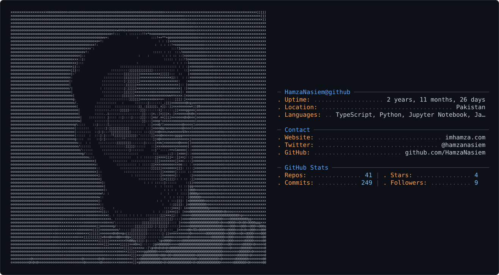

<picture>
  <source media="(prefers-color-scheme: dark)" srcset="dark_mode.svg" />
  <source media="(prefers-color-scheme: light)" srcset="light_mode.svg" />
  
</picture>

<!-- <div align="center">
  
</div>


<div align="center">
  <h3>🚀 Turning Coffee into Code & Agents into Autonomy</h3>
</div>

<p align="center">
  <a href="https://github.com/HamzaNasiem">
    
  </a>
  <a href="https://linkedin.com/in/hamzanasiem">
    
  </a>
  <a href="mailto:ziaee.pk@gmail.com">
    
  </a>
</p>

---

### 👨‍💻 **The Developer Profile**

I am an **AI Specialist** and **Full-Stack Developer** focused on the bleeding edge of **Generative AI** and **Microservices**. I don't just write code; I architect systems that scale and agents that think.

- 🔭 **Currently Working on:** Self-improving Agentic Workflows.
- 🤝 **Community Leadership:** Section Leader at **Stanford University's Code in Place**.
- 🏆 **Hackathons:** Finalist/Winner at **MIT & UC Berkeley** Hackathons.
- ⚡ **Superpower:** Orchestrating Kafka clusters while training LLMs.

---

### 🛠️ **Tech Stack & Arsenal**

<div align="center">

| **AI & LLMs** | **Backend & Cloud** | **Frontend & DB** |
| :---: | :---: | :---: |
|  |  |  |
|  |  |  |
|  |  |  |

</div>

---

### 💎 **Top-Tier Projects**

<table>
  <tr>
    <td width="50%">
      <h3 align="center">🤖 Agentic AI Chatbot</h3>
      <div align="center">
        <a href="https://github.com/HamzaNasiem/fastapi-openAI-SDK-nextjs-docker">
          
        </a>
      </div>
      <br>
      A next-gen chatbot that <b>browses the web in real-time</b>. Built with <b>OpenAI Agents</b> and <b>Tavily API</b>, wrapped in a high-performance <b>FastAPI</b> backend.
      <br><br>
      <code>Next.js 15</code> <code>FastAPI</code> <code>Docker</code>
    </td>
    <td width="50%">
      <h3 align="center">🛒 Microservices Mart API</h3>
       <div align="center">
        <a href="https://github.com/HamzaNasiem/ecommerce-mart-api">
          
        </a>
      </div>
      <br>
      An enterprise-grade <b>Event-Driven</b> system. Uses <b>Kafka</b> for async communication and <b>Kong Gateway</b> for traffic management. Designed for massive scale.
      <br><br>
      <code>Kafka</code> <code>Kong</code> <code>PostgreSQL</code>
    </td>
  </tr>
</table>

---

### 🔭 **Open Source Journey**

<table>
  <tr>
    <td width="15%" align="center">
       
    </td>
    <td width="85%">
      <h3>🚀 GSoC 2026 Aspirant</h3>
      I am actively preparing for <b>Google Summer of Code 2026</b>. My goal is to contribute to organizations focusing on <b>Agentic AI</b> and <b>Cloud Native</b> tools.
      <br><br>
      <i>Currently exploring codebases and refining skills... ⏳</i>
    </td>
  </tr>
</table>

---

### 📈 **Coding Activity & Stats**

<div align="center">
  
</div>

<br>

### 📈 Coding Consistency

<div align="center">
  
</div>


### 🏆 **Global Achievements**

<div align="center">

| **Stanford University** | **MIT & Berkeley** | **Harvard** |
| :---: | :---: | :---: |
| Code in Place **Section Leader** 👨‍🏫 | Hackathon **Finalist** 🚀 | CS50x Puzzle Day **Solver** 🧩 |

</div>

<br>

<p align="center">
  
</p>


<div align="center">
  
</div>
 -->


<div align="center">

# Hamza Naseem

**AI Voice Agent Engineer · Co-Founder @ Bytelytic · Stanford Code in Place SL 2026**

[](https://imhamza.com)
[](https://linkedin.com/in/hamzanasiem)
[](mailto:ziaee.pk@gmail.com)

</div>

---

I build AI systems for problems that shouldn't need a human in the loop.

Right now that's **voice AI** — receptionists that answer clinic calls, book appointments, and follow up with patients 24/7 without human intervention. Before I wrote code, I spent 8 years studying classical Islamic logic and Ibn Sina's syllogistic frameworks. That background shapes how I think about AI reliability: I don't build systems that work *most* of the time.

- 🏢 Co-Founder at **[Bytelytic](https://bytelytic.com)** — AI automation agency serving US & UK clients
- 🎓 Section Leader at **Stanford University** — Code in Place 2026
- 📄 Published research: **LogicGuard** — 100% precision, zero false positives, neuro-symbolic LLM validator
- 🏆 Google DeepMind Gemini 3 Hackathon — PulseScriptAI

---

## Projects

### [Bytelytic Clinic OS](https://github.com/HamzaNasiem/bytelytic-clinic-os)
Full SaaS platform for healthcare clinics. AI voice agent handles inbound calls, books appointments, sends SMS confirmations, and runs outbound patient recall — 24/7, no receptionist required.

`Retell AI` `FastAPI` `PostgreSQL` `Twilio` `React` `Docker` `Railway`

---

### [LogicGuard](https://github.com/HamzaNasiem/LogicGuard)
Neuro-symbolic middleware that deterministically intercepts structural hallucinations in LLMs. Built on Ibn Sina's syllogistic framework implemented as a BFS graph validator. Evaluated on LLaMA2-7B, Mistral-7B, LLaMA3.2-3B.

**100% precision · Zero false positives · Published on Zenodo**

`Python` `NetworkX` `LangChain` `Neuro-Symbolic AI`

[📄 Read the paper](https://zenodo.org/records/18745460) · [Read artical](https://hamza-naseem.medium.com/debugging-the-black-box-a-classical-logic-perspective-on-neuro-symbolic-ai-ac18deec7ea6)

---

### [Nexus — Multi-Agent Orchestrator](https://github.com/HamzaNasiem/nexus-ai-orchestrator)
Enterprise-grade multi-agent framework with autonomous workflow planning, agent handoffs, and real-time execution. Built for scale.

`LangGraph` `FastAPI` `Next.js` `OpenAI Agents SDK`

---

### [DocuMind — RAG Engine](https://github.com/HamzaNasiem/documind-rag)
Scalable Retrieval-Augmented Generation pipeline with distributed Qdrant vector DB and async Redis workers.

`FastAPI` `Qdrant` `Redis` `LangChain` `Docker`

---

## Stack

```
Voice AI    Retell AI · Vapi · Twilio
LLMs        OpenAI SDK · LangChain · LangGraph · OpenRouter
Backend     FastAPI · Python · PostgreSQL · Redis
Frontend    Next.js · React
DevOps      Docker · Railway · GitHub Actions
```

---

## Recognition

| | |
|---|---|
| **Stanford University** | Section Leader — Code in Place 2026 |
| **Zenodo** | Published — LogicGuard: Deterministic LLM Verification |
| **Google DeepMind** | Gemini 3 Global Hackathon — PulseScriptAI |
| **PIAIC** | Agentic AI Developer Certification |

---

<div align="center">

*Building things that work — not just things that demo well.*

</div>


